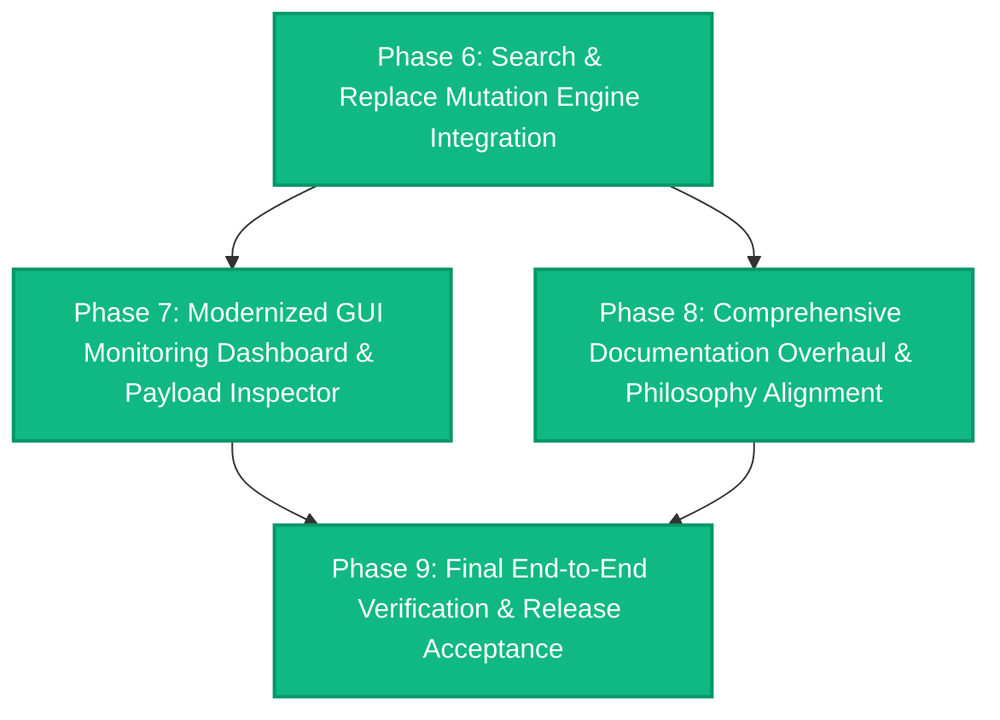

# Lightweight Self-Contained Context Engine

## Remaining Work, Architectural Evaluation & Revised Phasic Roadmap

**Target Workspace:** `unified-context-broker`  
**Current Baseline Status:** ✅ **Phases 0–9 Fully Implemented & Verified** (27 Test Suites, 139 Tests Passing, 13 Monorepo Packages Built Cleanly, Standalone Bundle Generated, Pure GUI Monitoring Live, Zero-Footprint Sandbox Confirmed)  
**Scope of this Document:** Authoritative phasic planning document detailing **strictly what is left to be done**. Incorporates the Search & Replace engine integration, comprehensive documentation alignment across the repository, and modernized GUI dashboard with timestamped activity logging and interactive request/response payload inspection.

---

## 1. Executive Status: Completed Baseline (Phases 0–5)

The foundational architecture and initial stabilization phases outlined in prior evaluations have been fully implemented, verified, and integrated into the active codebase:

* **Layer 0 (Contracts & Config):** Canonical Zod schemas (`BrokerConfigSchema`, `ScoringWeightsSchema`, `PolicyExclusionsSchema`), provider interfaces (`SymbolProvider`, `ImpactAnalysisProvider`, `RepositoryMapProvider`, `DurableMemoryProvider`), and configuration loaders are active.
* **Layer 1 (Security & Boundaries):** `WorkspaceBoundaryGuard` (jail containment, directory traversal prevention) and `SecretScrubber` (regex patterns for keys, tokens, high-entropy secrets) strictly govern all candidate streams.
* **Layer 2 (Core Processing):** Greedy knapsack token packing (`TokenBudgetManager`), AST outline extraction (`ASTOutlineExtractor`), PageRank dependency centrality (`CodebaseDependencyGraphCrawler` & `PageRankSolver`), and multi-list Reciprocal Rank Fusion (`RankFusionEngine.fuseMultiList`) are fully operational.
* **Layer 3 (Orchestration):** All retrieval flows route through typed `ContextOrchestrator` methods (`executeSearch`, `executeSymbolLookup`, `executeImpactAnalysis`, `executeRepositoryMap`, `executeDecisionRecall`, `executeDecisionRecord`), eliminating downcasting.
* **Phase 1 (Zero-Pollution Confinement & Internal Storage Isolation):** Complete. Telemetry (`events.jsonl`) and durable decision storage (`decisions.jsonl`) are strictly confined to `<brokerRoot>/.data/`. `getCandidateTelemetryDirs()` resolves relative to the engine installation directory; zero host-root files are created.
* **Phase 2 (Naming Schemes & Monorepo Structural Harmonization):** Complete. Adapters consolidated under `packages/adapter-*` (`adapter-lexical`, `adapter-codegraph`, `adapter-vector`, `adapter-git`, `adapter-memory`). Canonical tool aliases (`lookup_symbol`, `analyze_impact`, `get_repo_map`, `check_health`) are registered on the MCP server. Legacy `upstream/` directory has been removed.
* **Phase 3 (Single-Indicator Deployment Engine):** Complete. `bootstrap.py` deploys the single required external indicator to the host project root's `AGENTS.md` (or `agent.md`) using delimited `<!-- CONTEXT_BROKER_START -->` blocks. All internal rules and MCP configurations reside strictly within `<brokerRoot>/.agents/` and `<brokerRoot>/.vscode/`.
* **Phase 4 (Fully Contained Standalone Bundling):** Complete. Minified standalone bundle (`apps/mcp-server/dist/bundle.js`) packaged via `esbuild` for zero-dependency execution. VS Code extension configured for internal telemetry without host pollution.
* **Phase 5 (End-to-End Verification & Acceptance Gate):** Complete. Vitest test runner reports 24 passing test suites (120 tests total), including the `zero-footprint-sandbox.spec.ts` automated acceptance test proving 0 extraneous files outside the broker directory.

---

## 2. Current Architecture, Design Philosophy & Confinement Invariants

### 2.1 The Single External Indicator Mandate

When the context engine is embedded into any target host repository (e.g. at `./unified-context-broker/`):

> [!IMPORTANT]
> **Strict Confinement Invariant:**  
> The context engine must be **100% self-contained** within its own directory.  
> There must be **EXACTLY ONE indicator outside** this directory in the entire host codebase:  
> **The Usage Skill deployed directly into the codebase's `AGENTS.md` (or `agent.md`).**

Any host workspace file additions (such as `.context-broker/`, `.vscode/mcp.json`, `.cursor/`, or scattered rule files in the host root) violate repository isolation and are strictly prohibited.

```markdown
<!-- CONTEXT_BROKER_START -->
## Context Broker Retrieval Engine (Embedded)

This codebase embeds a self-contained context engine at `./unified-context-broker/`.
When inspecting, searching, navigating, or refactoring this repository, prioritize the embedded broker over brute-force file reads.

### Direct Retrieval Commands (Zero-Daemon CLI)
- **Hybrid Search:** `node ./unified-context-broker/packages/orchestrator/bin/cli.js search "<query>" --budget 8000`
- **Symbol Lookup:** `node ./unified-context-broker/packages/orchestrator/bin/cli.js symbol <name> [--file <path>]`
- **Repository Structure Digest:** `node ./unified-context-broker/packages/orchestrator/bin/cli.js digest`
- **Architectural Memory Recall:** `node ./unified-context-broker/packages/orchestrator/bin/cli.js memory recall "<query>"`
- **Persist Decision:** `node ./unified-context-broker/packages/orchestrator/bin/cli.js memory record --title "<title>" --decision "<decision>" --rationale "<rationale>"`
- **Engine Diagnostics:** `node ./unified-context-broker/packages/orchestrator/bin/cli.js --health`

### MCP Integration (IDE & Multi-Agent Swarms)
- **MCP Server Binary:** `node ./unified-context-broker/apps/mcp-server/dist/index.js`
- **Canonical Tools:** `search_context`, `get_symbol_context`, `lookup_symbol`, `get_impact_context`, `analyze_impact`, `get_repository_map`, `get_repo_map`, `recall_decisions`, `record_decision`, `explain_context`, `backend_health`, `check_health`
<!-- CONTEXT_BROKER_END -->
```

### 2.2 Core Architectural Philosophies

1. **Local-First & Zero-Daemon Execution:** The engine operates without requiring long-running daemon processes or cloud dependencies. Programmatic CLI commands and stdio MCP server provide instantaneous responses using local in-process indexing.
2. **Multi-Engine Hybrid Synthesis:** Lexical BM25, semantic vector similarity, AST call-graph centrality, and git recency are combined using Reciprocal Rank Fusion (RRF) and packed into a deterministic token budget.
3. **Transparent Provenance & Explainability:** Every retrieved candidate contains verifiable source citations, SHA-256 fingerprinting, line ranges, and scoring rationale.
4. **Defensive Workspace Security:** Path jail enforcement, symlink escape detection, and secret scrubbing occur before any candidate leaves the boundary.

---

## 3. Scope of Remaining Work

The remaining implementation scope focuses on three strategic pillars required to complete the engine's evolution:

1. **Search & Replace Mutation Engine (`search_and_replace`):**
   * Introduce a safe, atomic search-and-replace tool for code editing.
   * Maximize code reuse by leveraging existing capabilities:
     * `packages/adapter-lexical` for fast line-indexed text matching, regex patterns, and exact token locating.
     * `packages/adapter-codegraph` for AST structural boundary verification and symbol scope checking.
     * `packages/security` (`WorkspaceBoundaryGuard` & `SecretScrubber`) to guarantee edits remain within workspace boundaries and cannot introduce unscrubbed credentials or tokens.
   * Provide both single-chunk and multi-chunk replacements with a dry-run diff preview mode.
   * Expose both via MCP (`search_and_replace` with alias `replace_in_file`) and zero-daemon CLI (`cli.js replace`).

2. **Complete Documentation Overhaul & Design Alignment:**
   * Update all repository documentation to reflect current realities:
     * Update `README.md` to document the consolidated `packages/adapter-*` hierarchy, canonical tool aliases, zero-pollution confinement, and new search/replace capabilities.
     * Sanitize all residual workstation-specific file paths.
     * Update `PUBLISHING.md` with standalone `bundle.js` distribution workflows.
     * Update internal package READMEs (`packages/orchestrator`, `packages/contracts`, etc.) and rule templates.
     * Keep `report.md` continuously synchronized as the authoritative phasic blueprint.

3. **Modernized GUI Monitoring Dashboard (Strictly Monitoring, No Debugger Readouts or Test Runners):**
   * Update the dashboard web application (`apps/dashboard`) strictly as an observability and monitoring interface:
     * Focus exclusively on live telemetry, health observability, token savings metrics, and ADR durable memory inspection.
     * Eliminate debugger readouts, raw diagnostic memory dumps, and test execution runners—the GUI is strictly for monitoring agent activity.
     * Introduce a live **Activity & Telemetry Log** displaying exact timestamps (`YYYY-MM-DD HH:mm:ss.SSS`), tool names, execution latency, and token efficiency metrics.
     * Introduce an interactive **Request & Response Payload Inspector Modal**: clicking any entry in the log immediately reveals the full structured JSON request arguments and response output (with copy-to-clipboard functionality) to inspect what agents requested and received.

---

## 4. Revised Phasic Implementation Roadmap (Remaining Tasks)



### Phase 6: Search & Replace Mutation Engine Integration [COMPLETED]

**Objective:** Add a robust, atomic search/replace tool that leverages existing lexical, AST, and security components to execute precise file edits with boundary containment and dry-run preview.

* **Task 6.1: Core Replacement Contract & Schemas (`@context-broker/contracts`)** `[DONE]`
  * Define `SearchReplaceChunkSchema` (`targetContent`, `replacementContent`, optional `startLine`, `endLine`, `allowMultiple`).
  * Define `SearchReplaceRequestSchema`:
    * `targetFile`: Relative or absolute path to target file.
    * `replacements`: Array of replacement chunks.
    * `dryRun`: Boolean (defaults to `false`). When `true`, computes and returns diffs without writing to disk.
    * `isRegex`: Boolean (defaults to `false`).
    * `matchCase`: Boolean (defaults to `true`).
  * Define `SearchReplaceResultSchema` (`targetFile`, `modified`, `chunksApplied`, `unifiedDiff`, `tokensDelta`, `backupPath`).
  * Export schema types in `@context-broker/contracts`.

* **Task 6.2: Replacement Engine Implementation (`@context-broker/orchestrator`)** `[DONE]`
  * Implement `FileReplacementEngine` in `packages/orchestrator/src/mutation/`:
    * **Boundary Guard Integration:** Verify target file path using `WorkspaceBoundaryGuard.isPathPermitted()` to prevent path traversal or editing files inside excluded directories (`.git`, `node_modules`, `.env`).
    * **Secret Scrubber Integration:** Run `SecretScrubber.scrubText()` over `replacementContent` to alert or block accidental secret injection into source files.
    * **Lexical & AST Utilization:** Leverage line-indexed searching from `LexicalAdapter` logic to verify unique occurrences of target content; use `ASTOutlineExtractor` when applicable to warn if replacement breaks syntax or modifies across structural scopes.
    * **Atomic Write & Diff Generation:** Generate standard unified diffs; write modified content atomically using temporary file swap to eliminate partial writes.
  * Integrate into `ContextOrchestrator`: add `executeSearchReplace(request: SearchReplaceRequest)`.

* **Task 6.3: MCP Tool Surface & Canonical Aliases (`apps/mcp-server`)** `[DONE]`
  * Create `apps/mcp-server/src/tools/replace.ts`:
    * Expose `search_and_replace` tool definition and request handler.
    * Register canonical alias `replace_in_file` and `patch_file`.
    * Record tool execution in non-blocking telemetry with computed token deltas.
  * Register in `server.ts` alongside existing tools.

* **Task 6.4: Zero-Daemon CLI Command Parity (`packages/orchestrator/bin/cli.js`)** `[DONE]`
  * Add CLI command to `packages/orchestrator/bin/cli.js`:

    ```bash
    node ./packages/orchestrator/bin/cli.js replace <file> --find "<target>" --replace "<content>" [--dry-run]
    ```

  * Support reading replacement chunks from JSON payload or direct CLI flags.
  * Ensure output outputs unified diff and status in JSON or colored terminal text.

* **Task 6.5: Unit & Security Test Suite** `[DONE]`
  * Add unit tests in `packages/orchestrator/tests/replace.test.ts` and `apps/mcp-server/tests/replace-tool.test.ts`:
    * Test single contiguous replacement.
    * Test multi-chunk non-contiguous replacement in a single pass.
    * Test rejection of ambiguous target matches when `allowMultiple` is false.
    * Test dry-run mode (diff produced, original file unmodified).
    * Test boundary guard rejection (attempted edits outside workspace).
    * Test secret scrubber detection on injected API keys.

---

### Phase 7: Modernized GUI Monitoring Dashboard & Payload Inspector [COMPLETED]

**Objective:** Upgrade the standalone GUI dashboard (`apps/dashboard`) strictly as a dedicated monitoring and observability console. Eliminate debugger readouts, raw diagnostic dumps, and test execution mechanisms, focusing purely on operational visibility, live timestamped activity logging, request/response payload inspection, and token efficiency metrics.

* **Task 7.1: Backend Activity & Telemetry Stream API (`apps/dashboard/src/server.ts`)** `[DONE]`
  * Add `/api/logs` endpoint:
    * Reads execution history from `<brokerRoot>/.data/telemetry/events.jsonl`.
    * Supports query parameters: `limit` (default 50), `tool` filter, `since` timestamp.
    * Emits sorted records containing timestamp, event ID, tool name, execution time, token metrics, request arguments, and response payload.
  * Streamline existing endpoints to ensure strictly monitoring behavior (no test execution triggers or raw debugger memory readouts).

* **Task 7.2: Activity Log Interface with Precise Timestamps (`apps/dashboard/public`)** `[DONE]`
  * Add a dedicated **Activity Log** tab to the dashboard navigation in `index.html`.
  * Implement live log stream table in `app.js` and `style.css`:
    * Column 1: **Timestamp** (formatted `YYYY-MM-DD HH:mm:ss.SSS` with relative elapsed time tooltip).
    * Column 2: **Tool Name** (with distinct color badge: `search_context`, `lookup_symbol`, `search_and_replace`, etc.).
    * Column 3: **Status & Latency** (badge for `SUCCESS` / `ERROR`, duration in milliseconds).
    * Column 4: **Token Savings** (tokens reduced, reduction percentage).
    * Column 5: **Target / Query** (compact summary of target file or search string).
  * Auto-refresh toggle / polling mechanism to capture live agent executions in real time.

* **Task 7.3: Interactive Request & Response Payload Inspector Modal** `[DONE]`
  * When clicking any entry in the Activity Log, display a clean modal inspector dialog:
    * **Header:** Tool name, formatted ISO timestamp, execution duration, and status badge.
    * **Tab 1: Request Payload:** Formatted, syntax-highlighted JSON view of exact tool input arguments (e.g. query, target file, token budget, options).
    * **Tab 2: Response Payload:** Formatted, syntax-highlighted JSON view of full response returned to the agent (candidates, metadata, diffs, token metrics).
    * **Actions:** One-click "Copy Request JSON" and "Copy Response JSON" buttons.

* **Task 7.4: Streamline UI to Pure Monitoring View** `[DONE]`
  * Remove all testing or interactive simulation components:
    * Deprecate the interactive query runner and test inputs in favor of a clean, telemetry-first monitoring view.
    * Remove raw debugger diagnostic dumps from adapter cards, displaying clean status indicators (Operational, Healthy, Degraded) and item counts.
    * Present global token savings aggregate metrics (cumulative tokens saved, average reduction percentage, total queries processed).

---

### Phase 8: Comprehensive Documentation Overhaul & Philosophy Alignment [COMPLETED]

**Objective:** Synchronize all documentation across the monorepo to accurately represent the current architecture, zero-pollution confinement, single external indicator mandate, and extended toolset.

* **Task 8.1: Master `README.md` Modernization & Path Sanitization** `[DONE]`
  * Update directory structure diagram:
    * Replace legacy `adapters/` references with consolidated `packages/adapter-*`.
    * Remove obsolete references to `upstream/` directory.
    * Update total tool count to reflect 8 base tools + 4 canonical aliases + `search_and_replace`.
  * Detail the **Single External Indicator Mandate (`AGENTS.md`)**:
    * Explain why zero host-root pollution is guaranteed.
    * Provide updated copy-paste usage block.
  * Sanitize all local environment paths:
    * Purge any machine-specific user profile paths (`ZenFutral/OneDrive...`) from code examples and IDE configurations.
    * Replace with standard portable relative paths (`./apps/mcp-server/dist/bundle.js` or `./packages/orchestrator/bin/cli.js`).

* **Task 8.2: Publishing & Standalone Distribution Guide (`PUBLISHING.md`)** `[DONE]`
  * Document the standalone `bundle.js` distribution (`esbuild apps/mcp-server/src/index.ts --bundle --outfile=apps/mcp-server/dist/bundle.js`).
  * Detail zero-dependency execution across varied agent host runtimes (VS Code, Cursor, Windsurf, Antigravity IDE, plain Node.js).
  * Document VS Code extension packaging via `@vscode/vsce`.

* **Task 8.3: Package READMEs & Rule Template Harmonization** `[DONE]`
  * Ensure every package under `packages/` (`contracts`, `orchestrator`, `ranking`, `security`, `provenance`, and each `adapter-*`) contains an up-to-date `README.md` reflecting its API contract and dependencies.
  * Update canonical rule templates in `packages/contracts/src/templates/context-broker.md` and `rule.ts` to reference `search_and_replace` alongside retrieval tools.

* **Task 8.4: Durable Architectural Decision Record (ADR-004)** `[DONE]`
  * Record the architectural decision for the Search & Replace mutation engine, GUI payload inspector, and zero-pollution confinement into the broker's durable memory (`.data/memory/decisions.jsonl`):
    * **Title:** ADR-004: Safe Search/Replace Mutation Engine and Telemetry Payload Inspector
    * **Decision:** Implement atomic boundary-checked search/replace leveraging existing lexical and security modules; provide timestamped telemetry and payload inspection in GUI.
    * **Rationale:** AI agents require safe, localized mutation primitives alongside retrieval without polluting the host environment or introducing unscrubbed credentials.

---

### Phase 9: Final End-to-End Verification & Release Acceptance [COMPLETED]

**Objective:** Validate all remaining features across automated test suites, standalone bundles, and the modernized GUI.

* **Task 9.1: Monorepo Build & Bundle Verification** `[DONE]`
  * Execute clean monorepo build:

    ```bash
    npx pnpm run build
    ```

  * Verify that standalone bundle `apps/mcp-server/dist/bundle.js` builds cleanly (6.1MB) and responds to MCP JSON-RPC protocol requests.
* **Task 9.2: Monorepo Test Suite Gate** `[DONE]`
  * Execute all unit and integration test suites:

    ```bash
    npx pnpm test
    ```

  * Verify 100% test pass rate across all packages (27 test files, 139 tests passed in 6.8s).
* **Task 9.3: Zero-Footprint Acceptance Test Re-Verification** `[DONE]`
  * Run `zero-footprint-sandbox.spec.ts` ensuring that retrieval and search/replace mutation operations write zero unexpected files outside `<brokerRoot>/.data/` and target files.
* **Task 9.4: GUI Monitoring Dashboard Verification** `[DONE]`
  * Start dashboard server (`node apps/dashboard/dist/server.js`).
  * Verify pure monitoring operation: adapter health monitoring cards, cumulative token savings metrics, live timestamped activity logging, and click-to-inspect request/response payload modal (confirming no debugger readouts or test execution controls).

### Phase 10: Windows Automation (.bat & .cmd), Strict Naming Enforcement & Publishing Readiness [COMPLETED]

**Objective:** Implement native Windows startup and self-repair batch scripts, enforce strictly the `unified-context-broker` project naming across the repository, eliminate spurious directories, and package the release build.

* **Task 10.1: Native Windows Startup & Self-Repair Scripts (`start.bat`, `start.cmd`, `setup.bat`, `setup.cmd`)** `[DONE]`
  * Created robust `.bat` and `.cmd` scripts at the root that:
    * Validate Node.js (>= 20.0.0) and dynamically detect `pnpm` or fall back to `npx --yes pnpm@9.0.0`.
    * Auto-install dependencies if `node_modules` is missing.
    * Trigger setup validation and auto-fixing of missing internal directories (`.data/telemetry`, `.data/memory`).
    * Initialize missing durable ADR storage (`.data/memory/decisions.jsonl`).
    * Scaffold internal `.vscode/mcp.json` and `.agents/mcp_config.json` with correct absolute paths.
    * Auto-build missing packages and standalone bundle.
    * Run adapter health diagnostics across all 5 providers (comP, CodeGraph, Vector, Git, Memory).
    * Start the Dashboard GUI (`apps/dashboard/dist/server.js`) on port 4100 and launch default browser to `http://localhost:4100`.
    * Support `--validate` (`/v`), `--build` (`/b`), `--test` (`/t`), and `--fix` (`/f`) CLI flags.
  * Created `scripts/validate-and-fix.mjs` as a cross-platform ESM validation engine.
* **Task 10.2: Strict Project Naming Enforcement (`unified-context-broker`)** `[DONE]`
  * Standardized root `package.json` name to strictly `"unified-context-broker"`.
  * Updated `packages/contracts/src/config.ts` (`getBrokerRoot`) to recognize `unified-context-broker` monorepo root.
  * Corrected `AGENTS.md` and `bootstrap.py` to strictly use `unified-context-broker` (purging legacy `unified-context-broker-main` path variations).
  * Removed legacy `unified-context-broker-main` candidate paths from `apps/vscode-extension/src/initWorkspace.ts` and `apps/vscode-extension/src/telemetryBridge.ts`.
  * Fixed extension filtering in PowerShell scripts (`build-extension.ps1`, `install-to-vscode.ps1`, `publish-to-openvsx.ps1`) to use `./apps/vscode-extension` and `unified-context-broker-0.1.0`.
  * Implemented CLI `memory record` subcommand in `packages/orchestrator/bin/cli.js`.
* **Task 10.3: Repository Cleanup & Publishing Preparation** `[DONE]`
  * Removed spurious `./unified-context-broker/` and `./unified-context-broker-main/` directories from the repository root.
  * Verified `.gitignore` covers `.data/`, `node_modules/`, `dist/`, and `*.vsix`.
  * Rebuilt all 13 monorepo packages and compiled the zero-dependency standalone bundle `apps/mcp-server/dist/bundle.js` (6.1MB).
  * Packaged the VS Code companion extension VSIX `apps/vscode-extension/unified-context-broker-0.1.0.vsix` (31 KB).
  * Re-verified the entire test suite: 27 test files, 139 tests passed (100%).

---

## 5. Summary of Deliverables & Action Matrix

| Priority | Phase | Deliverable | Success Criteria / Status |
| :--- | :--- | :--- | :--- |
| **P0** | **Phase 6** | Search & Replace Core Engine & Schemas (`FileReplacementEngine`) | ✅ **Completed** (Atomic chunk replacement, boundary guard enforcement, secret scrubber validation, dry-run unified diff output). |
| **P0** | **Phase 6** | MCP Tool `search_and_replace` & CLI Parity (`cli.js replace`) | ✅ **Completed** (Exposed on MCP server with `replace_in_file` / `patch_file` aliases and zero-daemon CLI binary). |
| **P0** | **Phase 7** | Dashboard Activity Log with Precise Timestamps | ✅ **Completed** (Live table in dashboard rendering `YYYY-MM-DD HH:mm:ss.SSS` timestamps, latency, status badges, and token metrics). |
| **P0** | **Phase 7** | Interactive Request & Response Payload Inspector Modal | ✅ **Completed** (Clicking any log entry reveals formatted syntax-highlighted JSON for both request arguments and response output with copy buttons). |
| **P1** | **Phase 7** | Streamlined Pure Monitoring Dashboard | ✅ **Completed** (Elimination of test execution controls and raw debugger dumps; clean operational health, global token metrics, and auto-refresh stream). |
| **P0** | **Phase 8** | Complete `README.md` & Repository Documentation Overhaul | ✅ **Completed** (Clean architecture layout, zero foreign workstation paths, single indicator instructions, full 13-tool reference). |
| **P1** | **Phase 8** | Publishing Guide (`PUBLISHING.md`) & Package Docs | ✅ **Completed** (Standalone bundle execution documented; all 10 package READMEs created; rule templates updated). |
| **P0** | **Phase 9** | Comprehensive Monorepo Verification Gate | ✅ **Completed** (100% passing test suites [27/27 suites, 139/139 tests], zero-footprint sandbox pass, clean standalone bundle build & MCP handshake). |
| **P0** | **Phase 10** | Native Windows Startup Scripts (`start.bat`, `start.cmd`, `setup.bat`, `setup.cmd`) | ✅ **Completed** (Full startup, self-repair, health validation, and dashboard launch). |
| **P0** | **Phase 10** | Strict Project Naming Enforcement (`unified-context-broker`) | ✅ **Completed** (Purged all `unified-context-broker-main` and legacy variations from manifests, codes, and indicators). |
| **P0** | **Phase 10** | Release Packaging & Repository Cleanup | ✅ **Completed** (Removed spurious directories; packaged `unified-context-broker-0.1.0.vsix` and standalone bundle `apps/mcp-server/dist/bundle.js`). |


